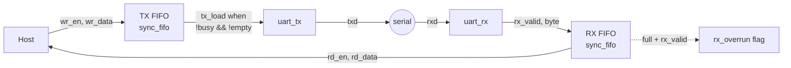
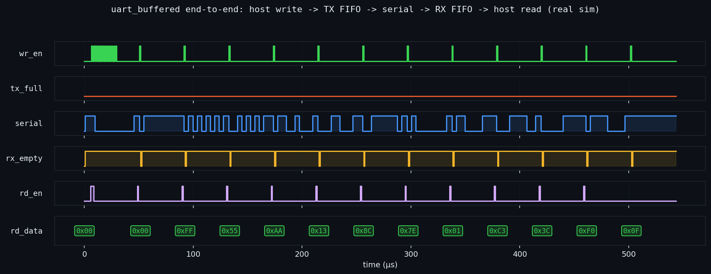

<div align="center">

# uart_buffered — FIFO-Buffered UART Subsystem

**System integration: three independently-verified blocks composed into one working subsystem.**


</div>

---

## 📌 What this is

A register-buffered UART built by **composing three blocks that are each verified in their own repository**:

| Block | Role here | Verified in |
|---|---|---|
| [`uart_tx`](https://github.com/jawadsa02/dlx-fpga-resa-bringup) | serializes bytes onto the line | formal + simulation |
| [`uart_rx`](https://github.com/jawadsa02/dlx-fpga-resa-bringup) | deserializes the line into bytes | formal + simulation |
| [`sync_fifo`](https://github.com/jawadsa02/sync-fifo-verified) | TX and RX buffering (×2) | **formally proven** + simulation |

This is the difference between a student who writes modules and an engineer who builds **subsystems**: reusing trusted IP, defining clean interfaces, and handling flow control and buffering at the boundaries.

## 🏗️ Architecture



**Interface:** push bytes (`wr_en`/`wr_data`, backpressure via `tx_full`); pop received bytes (`rd_en`/`rd_data`, `rx_empty`); `tx_level`/`rx_level` expose buffer occupancy; `rx_overrun` flags a dropped byte if the RX FIFO ever overflows. Flow control is automatic: the transmitter is loaded from the TX FIFO whenever it's idle and data is waiting.

## ✅ Verification plan

| # | Testpoint | Method | Status |
|---|---|---|---|
| V1 | Each sub-block correct in isolation | formal + sim in source repos | ✅ proven/tested upstream |
| V2 | Byte survives full path TX-FIFO → serial → RX-FIFO | end-to-end loopback testbench | ✅ 12/12 bit-exact |
| V3 | Buffering: burst written faster than serialized | burst-then-drain stimulus | ✅ `tx_full` never asserts at DEPTH 16 |
| V4 | Ordering preserved across the pipeline | scoreboard | ✅ in-order |
| V5 | No RX overrun under continuous drain | `rx_overrun` monitored every cycle | ✅ never asserted |
| V6 | Synthesizable as one netlist | Yosys synthesis gate | ✅ 1138 cells |
| V7 | Lint-clean | `verilator --lint-only -Wall` | ✅ 0 warnings |

### End-to-end waveform (real simulation output)



*A burst of 12 bytes is written into the TX FIFO (`wr_en`); `tx_full` never asserts; the serial line transmits frame after frame; each byte emerges from the RX FIFO in order — 0x00, FF, 55, AA, 13, 8C, 7E, 01, C3, 3C, F0, 0F.*

## 🏃 Run it

```bash
make test     # end-to-end self-checking simulation (Icarus)
make synth    # Yosys synthesis gate + cell report
make lint     # Verilator -Wall, zero warnings
```

CI runs lint + simulation + synthesis on every push.

## 📁 Structure

```
.
├── rtl/
│   ├── uart_buffered.v   # the subsystem (this repo's contribution)
│   ├── uart_tx.v         # vendored, verified in dlx-fpga-resa-bringup
│   ├── uart_rx.v         # vendored, verified in dlx-fpga-resa-bringup
│   └── sync_fifo.v       # vendored, formally proven in sync-fifo-verified
├── tb/tb_uart_buffered.v # end-to-end loopback scoreboard
├── docs/pipeline_waveform.png
├── Makefile · .github/workflows/ci.yml · LICENSE
```

---

<div align="center">

**Jawad Saied Ahmed** · [Portfolio](https://jawad-saied-ahmed.netlify.app) · [LinkedIn](https://linkedin.com/in/jawadsaidahmed)

</div>
