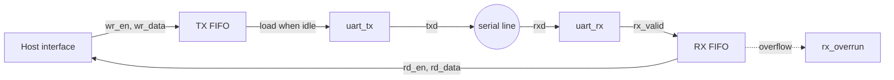
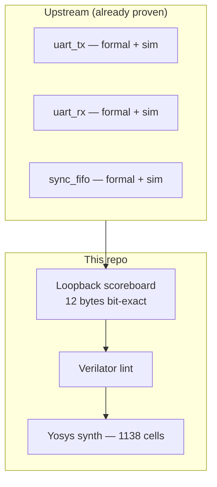

<div align="center">

# Buffered UART Subsystem

A register-buffered UART built from three blocks that were each verified separately — then composed and tested end-to-end.


</div>

---

## Context

Writing individual modules is one skill. Wiring them into a subsystem with correct flow control is another.

This repo takes `uart_tx` and `uart_rx` from the [DLX bring-up project](https://github.com/jawadsa02/dlx-fpga-resa-bringup) and two instances of the [formally verified FIFO](https://github.com/jawadsa02/sync-fifo-verified), then adds the glue logic: automatic TX loading, RX capture, occupancy counters, and overrun detection. For the scoreboard + coverage checking pattern in isolation, see [ai-verification-copilot](https://github.com/jawadsa02/ai-verification-copilot).

| Block | Role | Verified in |
|---|---|---|
| `uart_tx` | Serialize bytes onto the line | [dlx-fpga-resa-bringup](https://github.com/jawadsa02/dlx-fpga-resa-bringup) |
| `uart_rx` | Deserialize the line into bytes | [dlx-fpga-resa-bringup](https://github.com/jawadsa02/dlx-fpga-resa-bringup) |
| `sync_fifo` ×2 | TX and RX buffering | [sync-fifo-verified](https://github.com/jawadsa02/sync-fifo-verified) |
| `uart_buffered` | Integration + flow control | **this repo** |

## Block diagram



**Host side:** push bytes with `wr_en`/`wr_data` (backpressure via `tx_full`). Pop received bytes with `rd_en`/`rd_data` (`rx_empty` when nothing to read). `tx_level` and `rx_level` show how full each buffer is.

## Verification



| Check | Result |
|---|---|
| Full path TX FIFO → serial → RX FIFO | 12/12 bytes bit-exact |
| Burst write faster than line rate | `tx_full` never asserted at depth 16 |
| Byte ordering | In-order scoreboard pass |
| RX overrun under continuous drain | `rx_overrun` never asserted |
| Synthesis | 1138 cells (Yosys) |
| Lint | 0 warnings (Verilator `-Wall`) |

### Simulation waveform

<p align="center">
  
</p>

<p align="center"><em>Twelve bytes pushed into the TX FIFO, serialized on the line, and read back in order: 0x00, FF, 55, AA, 13, 8C, 7E, 01, C3, 3C, F0, 0F.</em></p>

## Run locally

```bash
make test     # end-to-end loopback (Icarus)
make synth    # Yosys synthesis + cell report
make lint     # Verilator -Wall
```

CI runs all three on every push.

## Layout

```
.
├── rtl/
│   ├── uart_buffered.v   # subsystem integration (this repo)
│   ├── uart_tx.v         # from dlx-fpga-resa-bringup
│   ├── uart_rx.v
│   └── sync_fifo.v       # from sync-fifo-verified
├── tb/tb_uart_buffered.v
├── docs/pipeline_waveform.png
└── Makefile · .github/workflows/ci.yml
```

---

<div align="center">

[Portfolio](https://jawad-saied-ahmed.netlify.app) · [LinkedIn](https://linkedin.com/in/jawadsaidahmed) · [GitHub](https://github.com/jawadsa02)

</div>
